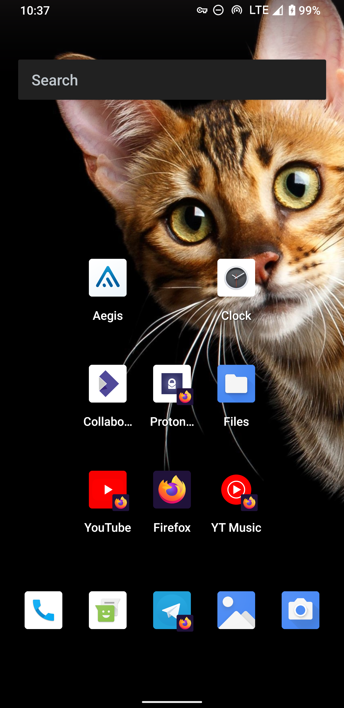
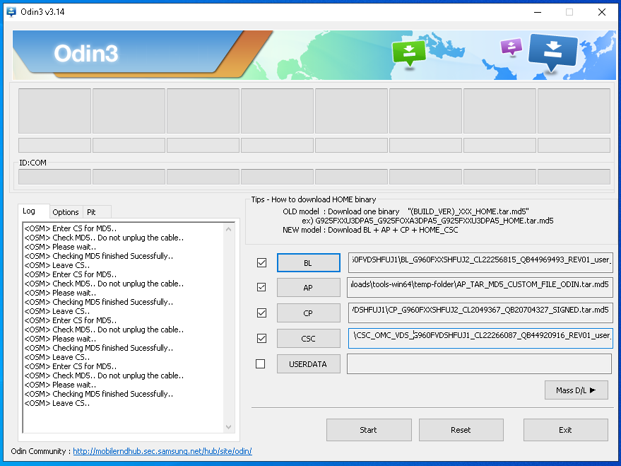

# How to build Android 13 for Galaxy S9 from scratch

  

I bought my Galaxy S9 in 2018 and it is still in great condition. Unfortunately, Samsung no longer provides security updates for this phone. So the only way to prevent turning more than 40 million phones into electronic waste and still keep them safe is to install a custom firmware (custom ROM). You can find plenty of ROMs in the Internet, but most of them contain some shady "optimizations" and require third-party apps like TWRP, Magisk, etc. The best ROM I found is [ArrowOS](https://www.arrowos.net/) but it's not ideal, because comparing to Samsung's original code it has some pretty harsh security changes. This is why I decided to make this instruction on how to build your own firmware from scratch using Google's and Samsung's open source code with minimal changes.

You will need to download about 70 GB of data so the faster your Internet connection the better. Compilation time depends on your hardware. On my 10-year-old laptop building Android itself takes 9 hours, building a linux kernel takes about 30 minutes.

## Hardware
Asus UX32VD
- **Processor:** Intel Core i7-3517U 1.9 GHz
- **Memory:** 2GB + 8GB 1600MHz DDR3
- **Storage:** Hitachi Travelstar Z5K500 500 GB, 5400 rpm

## Software
[Intel's ClearLinux OS](https://clearlinux.org/downloads) 35990

Bundles:
- [AOSP-dev](https://clearlinux.org/software/bundle/aosp-dev)
- [c-basic](https://clearlinux.org/software/bundle/c-basic)
- [llvm](https://clearlinux.org/software/bundle/llvm)
- [lz4](https://clearlinux.org/software/bundle/lz4)
- [make](https://clearlinux.org/software/bundle/make)
- [vim](https://clearlinux.org/software/bundle/vim)
- [storage-utils](https://clearlinux.org/software/bundle/storage-utils)
- [unzip](https://clearlinux.org/software/bundle/unzip)

## Downloading the Android Source code

### Installing Repo [*](https://source.android.com/setup/develop?hl=en#installing-repo)

```bash
export REPO=$(mktemp /tmp/repo.XXXXXXXXX)
curl -o ${REPO} https://storage.googleapis.com/git-repo-downloads/repo
gpg --recv-key 8BB9AD793E8E6153AF0F9A4416530D5E920F5C65
curl -s https://storage.googleapis.com/git-repo-downloads/repo.asc | \
gpg --verify - ${REPO} && \
install -m 755 ${REPO} ~/bin/repo
```

### Initializing a Repo client [*](https://source.android.com/setup/build/downloading?hl=en#initializing-a-repo-client)

Configure Git with your real name and email address.
```bash
git config --global user.name Your Name
git config --global user.email you@example.com
```

Install Repo in the current directory and download objects from Google's repository.
```bash
repo init -u https://android.googlesource.com/platform/manifest -b android-t-preview-1 --partial-clone

repo sync -c -j24
```

## Get some device specific code from the ArrowOS repository
```bash
mkdir ~/android
cd ~/android
```

```bash
mkdir -p ~/android/device/samsung
git clone -b arrow-12.0 https://github.com/ArrowOS-Devices/android_device_samsung_universal9810-common.git ~/android/device/samsung/universal9810-common
git clone -b arrow-12.0 https://github.com/ArrowOS-Devices/android_device_samsung_starlte.git ~/android/device/samsung/starlte
```

```bash
mkdir -p ~/android/vendor
git clone -b arrow-12.0 https://github.com/ArrowOS-Devices/android_vendor_samsung.git ~/android/vendor/samsung
```

```bash
mkdir -p ~/android/vendor/arrow/config

cat <<'EOF' > ~/android/vendor/arrow/config/common.mk
# Dex preopt
PRODUCT_DEXPREOPT_SPEED_APPS += \
    SystemUI \
    Launcher3QuickStep

# Do not include art debug targets
PRODUCT_ART_TARGET_INCLUDE_DEBUG_BUILD := false

# Do not include art debug targets
PRODUCT_ART_TARGET_INCLUDE_DEBUG_BUILD := false

# Strip the local variable table and the local variable type table to reduce
# the size of the system image. This has no bearing on stack traces, but will
# leave less information available via JDWP.
PRODUCT_MINIMIZE_JAVA_DEBUG_INFO := true

# Disable vendor restrictions
PRODUCT_RESTRICT_VENDOR_FILES := false
EOF
```

If you don't need a Google Assistant app on your phone then make the following changes:
```bash
rm -rf ~/android/device/samsung/universal9810-common/proprietary/priv-app/
rm -rf ~/android/device/samsung/universal9810-common/proprietary/system_ext/

cat "soong_namespace {}" > ~/android/device/samsung/universal9810-common/Android.bp

cat<<'EOF' > ~/android/device/samsung/universal9810-common/universal9810-common-vendor.mk
PRODUCT_SOONG_NAMESPACES += \
    vendor/samsung/universal9810-common

PRODUCT_COPY_FILES += \
    vendor/samsung/universal9810-common/proprietary/etc/nfc_key:$(TARGET_COPY_OUT_SYSTEM)/etc/nfc_key \
    vendor/samsung/universal9810-common/proprietary/etc/nfcee_access.xml:$(TARGET_COPY_OUT_SYSTEM)/etc/nfcee_access.xml \
    vendor/samsung/universal9810-common/proprietary/lib/hw/audio.playback_record.default.so:$(TARGET_COPY_OUT_SYSTEM)/lib/hw/audio.playback_record.default.so \
    vendor/samsung/universal9810-common/proprietary/lib/libsecaudiocoreutils.so:$(TARGET_COPY_OUT_SYSTEM)/lib/libsecaudiocoreutils.so \
    vendor/samsung/universal9810-common/proprietary/lib64/libaptX_encoder.so:$(TARGET_COPY_OUT_SYSTEM)/lib64/libaptX_encoder.so
EOF
```

To make sure that there are no any "surprises" in binary files in the ArrowOS repository I want to replace all of them using Samsung's stock firmware.

Download Samsung's stock firmware (4.2 GB):
```bash
cd ~/
pip3 install git+https://github.com/nlscc/samloader.git

python3 -m samloader -m SM-G960F -r DBT checkupdate

python3 -m samloader -m SM-G960F -r DBT download -v G960FXXSHFUJ2/G960FOXMHFUJ1/G960FXXSHFUJ2/G960FXXSHFUJ2 -O .

python3 -m samloader -m SM-G960F -r DBT decrypt -v G960FXXSHFUJ2/G960FOXMHFUJ1/G960FXXSHFUJ2/G960FXXSHFUJ2 -V 4 -i SM-G960F_2_20211026191812_7db86ry9u5_fac.zip.enc4 -o G960F-20211026.zip
```

Extract system.img
```bash
mkdir ~/G960F-20211026
unzip ~/G960F-20211026.zip -d ~/G960F-20211026

mkdir ~/G960F-20211026/AP
tar -xf AP_G960FXXSHFUJ2_CL22256815_QB44969493_REV01_user_low_ship_meta_OS10.tar.md5 --directory ~/G960F-20211026/AP

cd ~/G960F-20211026/AP
lz4 -d system.img.lz4 system.img
simg2img system.img system.img.RAW
```

Replace binary files
```bash
mkdir ~/G960F-20211026/AP/tmp

sudo mount -t ext4 -o loop,rw system.img.RAW ~/G960F-20211026/AP/tmp

cp ~/G960F-20211026/AP/tmp/system/lib/hw/audio.playback_record.default.so ~/android/vendor/samsung/proprietary/lib/hw/audio.playback_record.default.so

cp ~/G960F-20211026/AP/tmp/system/lib/libsecaudiocoreutils.so ~/android/vendor/samsung/proprietary/lib/libsecaudiocoreutils.so

cp ~/G960F-20211026/AP/tmp/system/lib64/libaptX_encoder.so ~/android/vendor/samsung/proprietary/lib64/libaptX_encoder.so

cp ~/G960F-20211026/AP/tmp/system/etc/nfc_key ~/android/vendor/samsung/proprietary/etc/nfc_key

cp ~/G960F-20211026/AP/tmp/system/etc/nfcee_access.xml ~/android/vendor/samsung/proprietary/etc/nfcee_access.xml
```


## Building Android [*](https://source.android.com/setup/build/building?hl=en)
---
**NOTE**

If your computer has less than 16 GB of RAM then to be able to complete the building process you have [to enable a zRAM module](https://www.kernel.org/doc/html/latest/admin-guide/blockdev/zram.html). Also you need to add the `-J-Xmx6g` flag into the [~/android/build/soong/java/droidstub.go](https://android.googlesource.com/platform/build/soong/+/refs/heads/master/java/droidstubs.go#458) file:
```go
cmd.BuiltTool("metalava").ImplicitTool(ctx.Config().HostJavaToolPath(ctx, "metalava.jar")).
	Flag(config.JavacVmFlags).
	Flag("-J-Xmx6g").
	Flag("-J--add-opens=java.base/java.util=ALL-UNNAMED").
	FlagWithArg("-encoding ", "UTF-8").
	FlagWithArg("-source ", javaVersion.String()).
	FlagWithRspFileInputList("@", android.PathForModuleOut(ctx, "metalava.rsp"), srcs).
	FlagWithInput("@", srcJarList)
```
---

```bash
cd ~/android
source build/envsetup.sh
lunch arrow_starlte-user
export PLATFORM_VERSION=12
export ANDROID_MAJOR_VERSION=s
export ARCH=arm64

make PLATFORM_VERSION=$PLATFORM_VERSION ANDROID_MAJOR_VERSION=$ANDROID_MAJOR_VERSION ARCH=$ARCH systemimage
```

```bash
mkdir ~/firmware
mv ~/android/out/target/product/starlte/system.img ~/firmware/system.img
lz4 -B6 --content-size ~/firmware/system.img ~/firmware/system.img.lz4
```

By default system.img doesn't contain an app to send or recieve SMS messages. You can build the Messaging app separately:
```bash
cd ~/android

source build/envsetup.sh

lunch arrow_starlte-user

mma messaging

cp ~/android/out/target/product/starlte/system/app/messaging.apk ~/firmware/messaging.apk
```


## Build a kernel

### Preparing source files
Navigate to [opensource.samsung.com](https://opensource.samsung.com/uploadSearch?searchValue=g960f) and download the latest kernel.

```bash
mkdir -p ~/android/kernel/samsung

mkdir -p ~/Downloads/kernel/SM-G960F

unzip ~/Downloads/SM-G960F_QQ_Opensource.zip -d ~/Downloads/kernel/SM-G960F

tar -zxvf ~/Downloads/kernel/SM-G960F/Kernel.tar.gz --directory ~/android/kernel/samsung/
```

To be able to complete building process we need [to remove redundant YYLOC global declaration](https://git.kernel.org/pub/scm/linux/kernel/git/stable/linux.git/commit/?h=v4.9.218&id=8e8ab8554aa4988db5e1028fbd02c51af676a7f2)
```bash
sed -i 's/YYLTYPE yylloc//' ~/android/kernel/samsung/universal9810/scripts/dtc/dtc-lexer.l

sed -i 's/YYLTYPE yylloc//' ~/android/kernel/samsung/universal9810/scripts/dtc/dtc-lexer.lex.c_shipped
```

Also we need to disable Samsung's Defex<sup>[1](https://insights.samsung.com/2021/10/21/this-is-protection-samsung-knox-2/), [2](https://r2.community.samsung.com/t5/Others/Security-and-safety-with-Samsung-Knox/td-p/4734152)</sup> mechanism, otherwise the kernel will not be able to boot a custom firmware.
```bash
sed -i 's/CONFIG_SECURITY_DEFEX=y/# CONFIG_SECURITY_DEFEX is not set/' ~/android/kernel/samsung/universal9810/arch/arm64/configs/exynos9810-starlte_defconfig
```

### Build a kernel
```bash
cd ~/android/kernel/samsung/

virtualenv -p ~/android/prebuilts/python/linux-x86/2.7.5/bin/python2.7 temp-python2
source temp-python2/bin/activate

export PLATFORM_VERSION=10
export ANDROID_MAJOR_VERSION=q
export ARCH=arm64
export CROSS_COMPILE=~/android/kernel/samsung/universal9810/toolchain/gcc-cfp/gcc-ibv-jopp/aarch64-linux-android-4.9/bin/aarch64-linux-android-
make exynos9810-starlte_defconfig
make PLATFORM_VERSION=$PLATFORM_VERSION ANDROID_MAJOR_VERSION=$ANDROID_MAJOR_VERSION ARCH=$ARCH CROSS_COMPILE=$CROSS_COMPILE -j16

deactivate
```

```bash
cp ~/android/kernel/samsung/universal9810/arch/arm64/boot/Image ~/android/out/target/product/starlte/kernel

cd ~/android
source build/envsetup.sh
lunch arrow_starlte-user
make -j8 PLATFORM_VERSION=$PLATFORM_VERSION ANDROID_MAJOR_VERSION=$ANDROID_MAJOR_VERSION ARCH=$ARCH CROSS_COMPILE=$CROSS_COMPILE bootimage
```

By default boot.img doesn't contain a dbt file:
```bash
python ~/android/system/tools/mkbootimg/unpack_bootimg.py --boot_img ~/android/out/target/product/starlte/boot.img --out ~/boot.img.RAW
ls -lah ~/boot.img.RAW

# Output:
#
# kernel
# ramdisk
#
```

To get the correct boot.img we need to recreate image manualy using header_version=2:
```bash
~/android/system/tools/mkbootimg/mkbootimg.py \
--kernel ~/android/kernel/samsung/universal9810/arch/arm64/boot/Image \
--dtb ~/android/kernel/samsung/universal9810/arch/arm64/boot/dts/exynos/exynos9810-starlte_eur_open_26.dtb \
--pagesize 2048 \
--ramdisk ~/android/out/target/product/starlte/ramdisk.img  \
--header_version 2 \
--os_version 12.0.0 \
--os_patch_level 2021-08 \
--cmdline androidboot.selinux=permissive \
--out ~/firmware/boot.img
```

```bash
lz4 -B6 --content-size ~/firmware/boot.img ~/firmware/boot.img.lz4
```

That's it. Now you can flash system and boot images using [Haimdall](https://github.com/Benjamin-Dobell/Heimdall) or [Odin](https://en.wikipedia.org/wiki/Odin_(firmware_flashing_software)).

## Flash your custom ROM using Odin

Create a script
```bash
cat<< 'EOF' > ~/firmware/createCustomOdinPackage.sh
echo -e "\n"
echo "----------------Setup ENV----------------"
# Delete Previous Images
rm -f AP_CUSTOM.tar.md5
rm -rf temp-folder
curentDir=$(pwd)
echo "Current dir: $curentDir"


echo -e "\n\n"
echo "-------------Build TAR Files-------------"
mkdir temp-folder
for file in *.lz4; do
  echo "Current file: $file"
  tar --create \
      --file "$curentDir/temp-folder/$file.tar" \
      --format=gnu \
      --blocking-factor=20 \
      --quoting-style=escape \
      --owner=0 \
      --group=0 \
      --mode=644 \
      --verbose \
      --totals \
      $curentDir/$file
done


echo -e "\n\n"
echo "--Build AP_CUSTOM.tar--"
cd temp-folder
ls *.lz4.tar > temp-file.txt
tar --create \
    --file "AP_CUSTOM.tar" \
    --files-from "temp-file.txt" \
    --format=gnu \
    --blocking-factor=20 \
    --quoting-style=escape \
    --owner=0 \
    --group=0 \
    --mode=644 \
    --verbose \
    --totals
rm temp-file.txt
cd $curentDir


echo -e "\n\n"
echo "-------Create the MD5 Final File---------"
cd temp-folder
md5sum --text AP_CUSTOM.tar >> AP_CUSTOM.tar
cd $curentDir
mv temp-folder/AP_CUSTOM.tar AP_CUSTOM.tar.md5


echo -e "\n\n"
echo "-------------Cleaning Files--------------"
rm -rf temp-folder
EOF
```

Build a custom package for Odin
```bash
sudo chmod +x ~/firmware/createCustomOdinPackage.sh

cd ~/firmware/

bash ./createCustomOdinPackage.sh
```

Download Odin
```
mkdir ~/firmware/odin

curl https://dl2018.sammobile.com/Odin3-v3.14.1.zip -o ~/firmware/Odin3-v3.14.1.zip

unzip -j ~/firmware/Odin3-v3.14.1.zip "Odin3.ini" "Odin3 v3.14.1.exe" -d ~/firmware/odin
```

Flash the ~/firmware/AP_CUSTOM.tar.md5 file using Odin


<br />
<br />
 
[This article on Medium](https://ruslanbay.medium.com/how-to-build-android-13-for-galaxy-s9-from-scratch-d8e5888b68a4)
